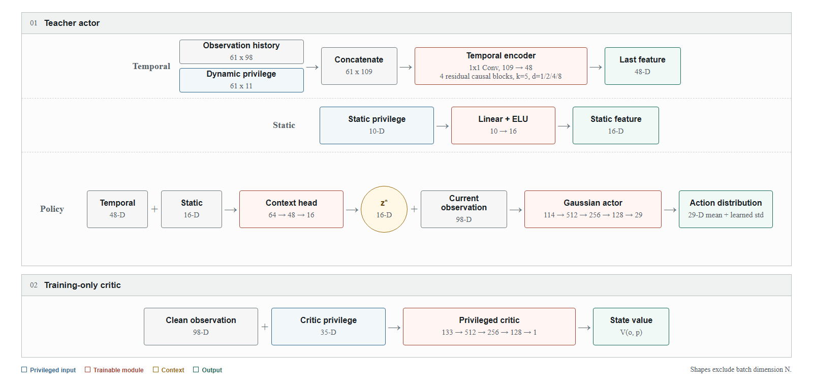
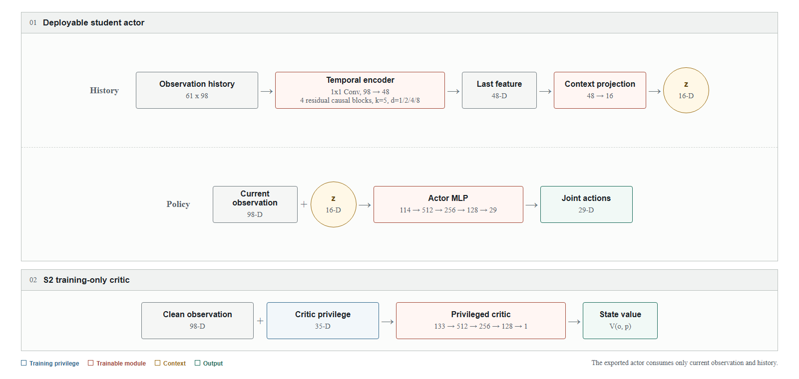

# G1 Rickshaw Slopes

A MjLab reinforcement-learning task in which a Unitree G1 pulls a two-wheeled
rickshaw over 19 fixed slopes.

## Requirements

| Component | Version |
| --- | --- |
| Python | `>=3.10,<3.14` |
| PyTorch | `>=2.7.0` |
| MuJoCo | `3.10.0` |
| MjLab | `1.5.3` |
| MuJoCo-Warp | `3.10.0.3` |
| RSL-RL | `5.4.0` |

Linux with an NVIDIA GPU is recommended for training. Install the package in
editable mode because assets and configuration are resolved from the repository:

```bash
cd /path/to/rickshaw1

PYTHON=/path/to/python
"$PYTHON" -m pip install --upgrade pip
"$PYTHON" -m pip install -e "source/g1_rickshaw_lab"
```

Install Ruff separately for linting:

```bash
"$PYTHON" -m pip install ruff
```

## Quick Start

```bash
cd /path/to/rickshaw1
PYTHON=/path/to/python

"$PYTHON" scripts/validate_static_initialization.py
"$PYTHON" scripts/train_pipeline.py --gpu-ids 0
```

## Registered Tasks

| Stage | Task ID | Algorithm | Iterations | Curriculum |
| --- | --- | --- | ---: | --- |
| S0 | `Mjlab-G1-Rickshaw-Slopes-Teacher` | Privileged PPO | 6000 | S0 |
| S1 | `Mjlab-G1-Rickshaw-Slopes-Distillation` | Online distillation | 6000 | None |
| S2 | `Mjlab-G1-Rickshaw-Slopes-Student` | Student PPO | 800 | S2 |

## Architecture

### Physical Model

- G1 exposes 29 controlled joints; Dex1 finger joints are fixed.
- Two grasp sites are connected to the rickshaw hitches with MuJoCo `connect`
  equalities.
- G1 uses the MjLab 1.5.3 Unitree actuator configuration.
- Robot-rickshaw collisions and visual-mesh collisions are disabled while robot
  self-collision and physical ground contacts remain active.

#### MuJoCo Solver Configuration

Training and playback use batched MjLab/MuJoCo-Warp simulation. Static-pose
generation uses a standalone CPU MuJoCo model. Parameters not set by this
project retain the framework defaults shown below:

| Parameter | Training/play | Static model | Meaning |
| --- | ---: | ---: | --- |
| `timestep` | `0.005 s` | `0.005 s` | 200 Hz physics step. |
| Control decimation | `4` | N/A | One action per `0.02 s` (50 Hz). |
| `integrator` | `implicitfast` | `Euler` | Time integrator; inherited defaults differ. |
| `solver` | `Newton` | `Newton` | Constraint solver. |
| `cone` | `pyramidal` | `pyramidal` | Friction-cone representation. |
| `jacobian` | `auto` | `auto` | Dense/sparse Jacobian selection. |
| `iterations` | `10` | `10` | Maximum main solver iterations per step. |
| `tolerance` | `1e-8` | `1e-8` | Main solver early-termination tolerance. |
| `ls_iterations` | `20` | `20` | Maximum line-search iterations. |
| `ls_tolerance` | `0.01` | `0.01` | Line-search tolerance. |
| `ccd_iterations` | `50` | `50` | Maximum convex collision solver iterations. |
| `impratio` | `1.0` | `1.0` | Friction-to-normal contact impedance ratio. |

The project explicitly sets `timestep`, `iterations`, `ls_iterations`, and
`ccd_iterations` in both models. Decimation belongs only to the MjLab
environment. Batched allocation settings are:

| Parameter | Value | Meaning |
| --- | ---: | --- |
| `nconmax` | `None` | MjLab selects contact capacity per world heuristically. |
| `njmax` | `600` | Maximum allocated constraints per world. |
| `contact_sensor_maxmatch` | `64` | Maximum matching contacts considered per contact sensor. |

The two hand-hitch `connect` equalities inherit
`solref=(0.02, 1.0)` and `solimp=(0.9, 0.95, 0.001, 0.5, 2.0)`.

MuJoCo friction triples are `(sliding, torsional, rolling)`:

| Geometry or constraint | Asset/static setting | Runtime behavior |
| --- | --- | --- |
| Terrain plane | `friction=(1.0, 0.005, 0.0001)` | Sliding friction is replaced by `terrain.friction`. |
| G1 foot collision spheres | `condim=3`, `priority=1`, `friction=(0.6, 0.005, 0.0001)` | Sliding friction is replaced by `terrain.friction`. |
| Other physical G1 geoms | `condim=1`; ground and self-collision enabled | Sliding friction is replaced by `terrain.friction`. |
| Rickshaw wheels | Ground collision enabled; damping `0.02` | Sliding friction follows `terrain.friction`; damping is randomized per wheel during training. |
| Rickshaw body and visual geoms | Contact disabled | No contact. |
| Dex1 gripper geoms | Contact disabled | Hands are coupled to the hitches by equalities. |

`scripts/validate_static_initialization.py` writes the certified flat-ground
state to `config/static_rest_poses.json`; reset code transforms it to each slope.
Training slopes run from `-0.08` to `0.10 rad` in `0.01 rad` increments.

### Manager-Based Environment

The environment derives from MjLab's `unitree_g1_flat_env_cfg()`:

| Manager | Project responsibility |
| --- | --- |
| Scene | G1, rickshaw, closed-chain equalities, and contact sensors |
| Event | Domain initialization, certified reset, and rolling resistance |
| Command | Rickshaw forward and yaw velocity in the terrain frame |
| Observation | Actor sequence, teacher privilege, and critic privilege |
| Action | Joint-position targets around the slope-specific static pose |
| Reward | MjLab G1 rewards plus rickshaw-specific terms |
| Curriculum | S0 and S2 schedules for rickshaw penalties |
| Termination | Timeout or excessive G1 tilt |

Training uses 8192 environments with `6 m` spacing. Play mode uses one
environment and disables observation noise, domain randomization, and reward
curricula.

### Commands and Actions

The `twist` command is resampled every `3-8 s`:

| Component | Range |
| --- | --- |
| Forward velocity | `[-1.5, 2.0] m/s` |
| Lateral velocity | `0` |
| Yaw velocity | `[-0.7, 0.7] rad/s` |

Actions are 29 normalized joint-position offsets:

```text
joint_target = q_ref + normalized_action * G1_ACTION_SCALE
```

`q_ref` is the certified slope-specific joint pose. Per-joint scale is
`0.25 * effort_limit / stiffness`.

### Observations and Models

The deployable actor observation is fixed at 98 dimensions:

| Slice | Width | Feature | Scale |
| --- | ---: | --- | ---: |
| `0:3` | 3 | G1 base linear velocity | 1.0 |
| `3:6` | 3 | G1 base angular velocity | 0.25 |
| `6:9` | 3 | Projected gravity | 1.0 |
| `9:11` | 2 | Forward and yaw command | 1.0 |
| `11:40` | 29 | Joint position error | 1.0 |
| `40:69` | 29 | Joint velocity | 0.05 |
| `69:98` | 29 | Previous action | 1.0 |

#### Teacher Dynamic Privilege

The teacher receives a 61-frame history of the following 11-D state:

| Slice | Width | Feature |
| --- | ---: | --- |
| `0:2` | 2 | Rickshaw forward velocity and yaw angular velocity |
| `2:3` | 1 | Rickshaw pitch |
| `3:5` | 2 | Left and right wheel normal forces |
| `5:8` | 3 | Left hand force in path tangent, lateral, and normal axes |
| `8:11` | 3 | Right hand force in path tangent, lateral, and normal axes |

The teacher actor applies empirical normalization to this sequence.

#### Teacher Static Privilege

The following 10-D state is fixed for an episode:

| Slice | Width | Feature |
| --- | ---: | --- |
| `0:1` | 1 | Effective G1 torso mass |
| `1:2` | 1 | Effective rickshaw total mass |
| `2:5` | 3 | Effective rickshaw center of mass `(x, y, z)` |
| `5:6` | 1 | Rolling-resistance coefficient |
| `6:7` | 1 | Terrain sliding-friction coefficient |
| `7:9` | 2 | Left and right wheel damping |
| `9:10` | 1 | Terrain slope angle |

Configured bounds are mapped to `[-1, 1]` before the teacher's empirical
normalizer.

#### Critic Privilege

The critic receives the clean 98-D actor observation and this 35-D privileged
state:

| Slice | Width | Feature |
| --- | ---: | --- |
| `0:10` | 10 | Teacher static privilege |
| `10:21` | 11 | Current teacher dynamic privilege |
| `21:22` | 1 | Rickshaw forward acceleration |
| `22:23` | 1 | Rickshaw yaw angular acceleration |
| `23:25` | 2 | Left and right foot height |
| `25:27` | 2 | Left and right foot air time |
| `27:29` | 2 | Left and right foot contact flag |
| `29:35` | 6 | Left and right foot contact force `(x, y, z)`, signed `log1p` transformed |

The resulting critic input is 133-D. The student actor receives only the
current actor observation and its preceding 61-frame actor history.

#### Teacher Network



#### Student Network



### Domain Randomization

Nine physical parameters are sampled once per environment:

| Parameter | Range |
| --- | --- |
| `torso.mass_delta` | `[-1.0, 3.0] kg` |
| `payload.mass` | `[-3.0, 3.0] kg` |
| `payload.com.x` | `[0.3, 0.9] m` |
| `payload.com.y` | `[-0.15, 0.15] m` |
| `payload.com.z` | `[0.45, 0.95] m` |
| `rolling_resistance.c_rr` | `[0.01, 0.03]` |
| `terrain.friction` | `[0.6, 1.1]` |
| `wheel.left_damping` | `[0.015, 0.025]` |
| `wheel.right_damping` | `[0.015, 0.025]` |

Ranges and nominal values are defined in `config/feasibility_envelope.yaml`.

## Rewards and Curricula

Project-specific and reweighted terms are:

| Reward term | Final weight |
| --- | ---: |
| `track_linear_velocity` | 2.0 |
| `track_angular_velocity` | 2.0 |
| `arm_joint_velocity_l2` | -0.0015 |
| `rickshaw_forward_acceleration_l2` | -0.05 |
| `rickshaw_pitch_angular_acceleration_l2` | -0.01 |
| `rickshaw_yaw_angular_acceleration_l2` | -0.01 |
| `rickshaw_pitch_angular_velocity_l2` | -1.0 |
| `rickshaw_wheel_slip_l2` | -0.1 |
| `rickshaw_absolute_pitch_deviation_l2` | -0.5 |
| `rickshaw_g1_relative_position_l2` | -4.0 |
| `rickshaw_g1_relative_yaw_l2` | -0.6 |
| `peak_force` | -3.0 |
| `hitch_height_recovery_l2` | -0.25 |

Six dynamics penalties and two relative-pose penalties are ramped during S0 and
S2. The table values are multipliers of their final weights.

S0 curriculum:

| Iteration | Dynamics | Relative pose |
| ---: | ---: | ---: |
| 0 | 0.02 | 0.04 |
| 300 | 0.10 | 0.15 |
| 600 | 0.25 | 0.30 |
| 900 | 0.45 | 0.50 |
| 1200 | 0.70 | 0.75 |
| 1500 | 1.00 | 1.00 |

S2 curriculum:

| Iteration | Dynamics | Relative pose |
| ---: | ---: | ---: |
| 0 | 0.05 | 0.10 |
| 100 | 0.20 | 0.25 |
| 200 | 0.50 | 0.50 |
| 300 | 0.75 | 0.75 |
| 400 | 1.00 | 1.00 |

S1 and play mode do not apply reward-weight curricula.

## Workflows

All commands run from the repository root and assume:

```bash
PYTHON=/path/to/python
```

### Static Initialization

```bash
"$PYTHON" scripts/validate_static_initialization.py
```

### Train

```bash
"$PYTHON" scripts/train_pipeline.py --gpu-ids 0
```

Common operational overrides are `--num-envs`, `--s0-iterations`,
`--s1-iterations`, `--s2-iterations`, `--seed`, `--log-root`, and
`--gpu-ids`. Use `--gpu-ids all` for all available GPUs or `None` for a
small CPU debug run.

Run stages separately:

```bash
"$PYTHON" scripts/train_teacher.py --gpu-ids 0

TEACHER=/absolute/path/to/s0_teacher_checkpoint.pt
"$PYTHON" scripts/train_context.py --teacher "$TEACHER" --gpu-ids 0

CONTEXT=/absolute/path/to/s1_context_checkpoint.pt
"$PYTHON" scripts/finetune_student.py \
  --teacher "$TEACHER" \
  --context "$CONTEXT" \
  --gpu-ids 0
```

Resume S0 or S2 with `--resume-checkpoint`. A fresh S2 run requires both the S0
teacher and S1 context checkpoints; a resumed S2 run uses only its S2 checkpoint.

### Play and Export

```bash
STUDENT=/absolute/path/to/s2_student_checkpoint.pt

"$PYTHON" scripts/play.py \
  Mjlab-G1-Rickshaw-Slopes-Student \
  --checkpoint-file "$STUDENT" \
  --viewer viser
```

Use `--slope 0.05` to select one configured slope. Without it, environments
are assigned across all 19 slopes.

Export the deployable student:

```bash
"$PYTHON" scripts/export_student.py --checkpoint "$STUDENT"
```

The exporter writes `exported/policy.pt` and `exported/policy.onnx` beside the
checkpoint. Both accept `current [N,98]` and `history [N,61,98]`, and return
`actions [N,29]`.

### Lint

```bash
"$PYTHON" -m ruff check \
  scripts \
  source/g1_rickshaw_lab/g1_rickshaw_lab
```

## Outputs

```text
logs/rsl_rl/
  g1_rickshaw_teacher/<timestamp>_s0/model_<iteration>.pt
  g1_rickshaw_context/<timestamp>_s1/model_<iteration>.pt
  g1_rickshaw_student/<timestamp>_s2/model_<iteration>.pt

outputs/
  nan_dumps/

config/
  static_rest_poses.json
```

## Repository Layout

| Path | Responsibility |
| --- | --- |
| `assets/` | G1/Dex1 and rickshaw URDF, STL, and mesh assets. |
| `config/` | Feasibility ranges and the certified static pose. |
| `docs/` | Rendered Teacher and Student network diagrams. |
| `scripts/validate_static_initialization.py` | Solve and save the static certificate. |
| `scripts/train_pipeline.py` | Run S0, S1, and S2 in sequence. |
| `scripts/train_teacher.py`, `train_context.py`, `finetune_student.py` | Run individual training stages. |
| `scripts/play.py`, `export_student.py` | Playback and policy export. |
| `source/g1_rickshaw_lab/g1_rickshaw_lab/assets/` | Build MuJoCo robot and rickshaw specs. |
| `source/g1_rickshaw_lab/g1_rickshaw_lab/rl/` | Teacher/student encoders and RSL-RL adapters. |
| `source/g1_rickshaw_lab/g1_rickshaw_lab/tasks/manager_based/rickshaw_velocity/` | Scene, managers, closed chain, terrain, resets, rewards, and agents. |

## Compatibility Rules

- Keep model dimensions identical across S0, S1, S2, playback, and export.
- Fresh S2 initialization requires both an S0 teacher checkpoint and an S1
  context checkpoint.
- S2 resume cannot be combined with `--teacher` or `--context`.
- Re-run static initialization after changing URDFs, mesh transforms,
  equalities, collision masks, or actuators.
